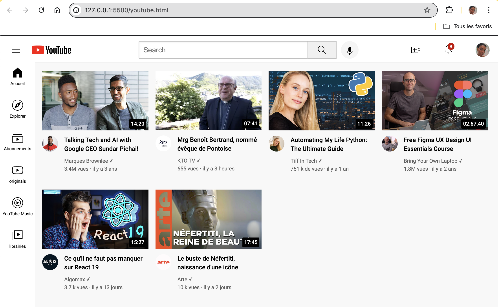

Description

Le projet est une réplique de l'interface utilisateur de YouTube, simulant les principales fonctionnalités de la plateforme de partage de vidéos. Il permet aux utilisateurs de parcourir des vidéos, de les visionner et d'interagir avec les différentes sections de l'interface.

Technologies Utilisées

HTML/CSS : Pour la structure et le design des pages web.
Images et Icônes : Utilisées pour recréer l'apparence visuelle de l'interface.

Fonctionnalités Principales

1. Page d'accueil : Affichage des vidéos recommandées et des tendances.
2. Barre de recherche : Permet de rechercher des vidéos par mots-clés.
3. Barre latérale : Accès rapide aux différentes sections comme Accueil, Tendances, Abonnements, etc.
4. Page de lecture vidéo : Interface pour visionner les vidéos avec des options de contrôle de la lecture.

